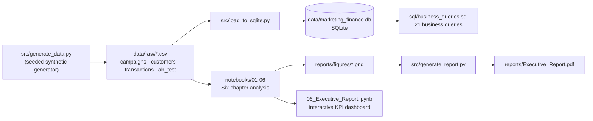
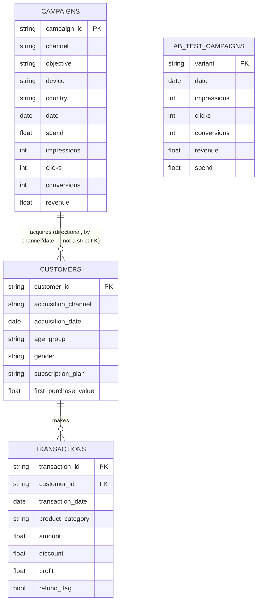
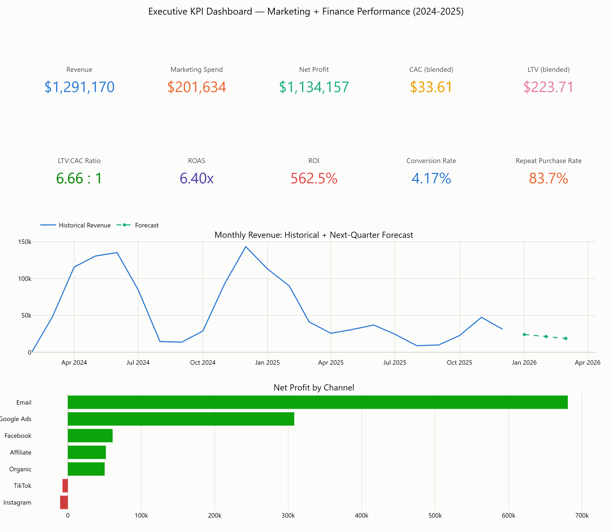
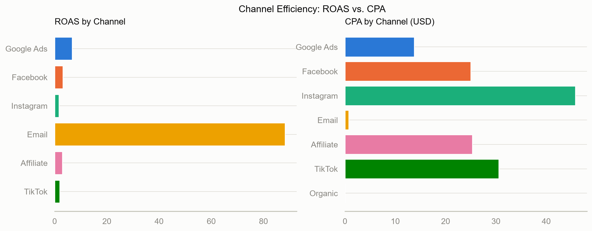
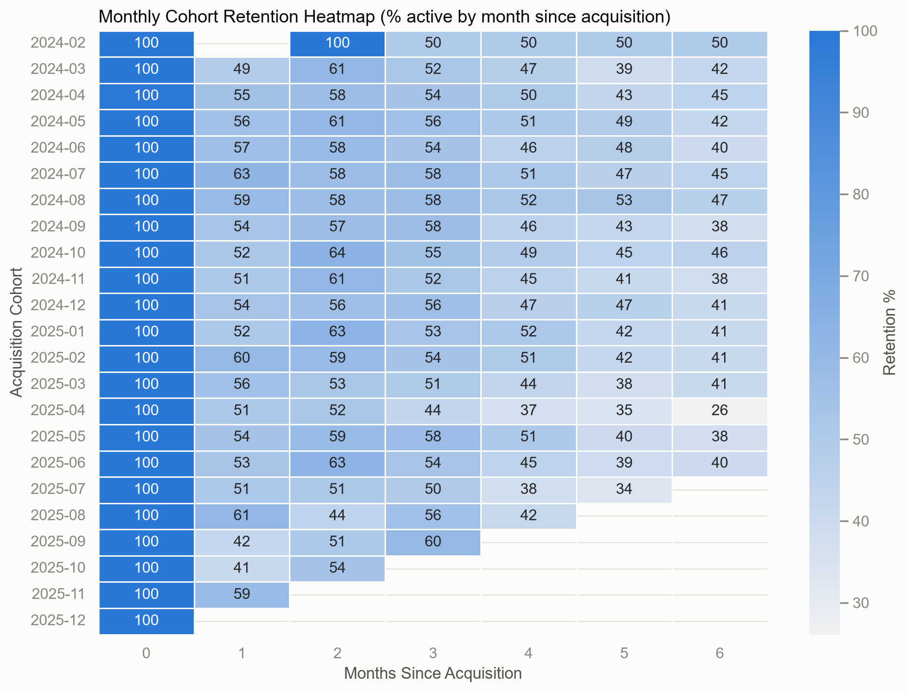
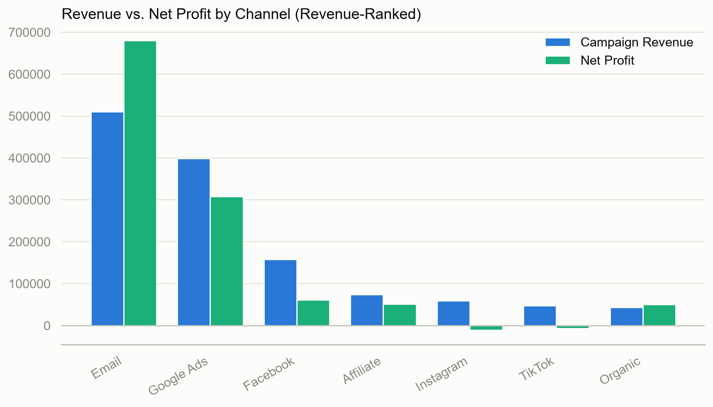
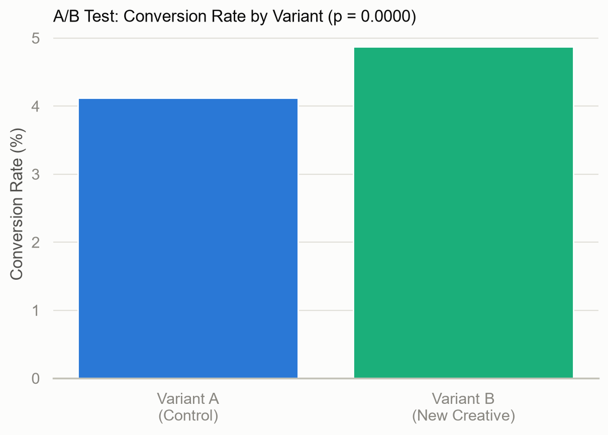
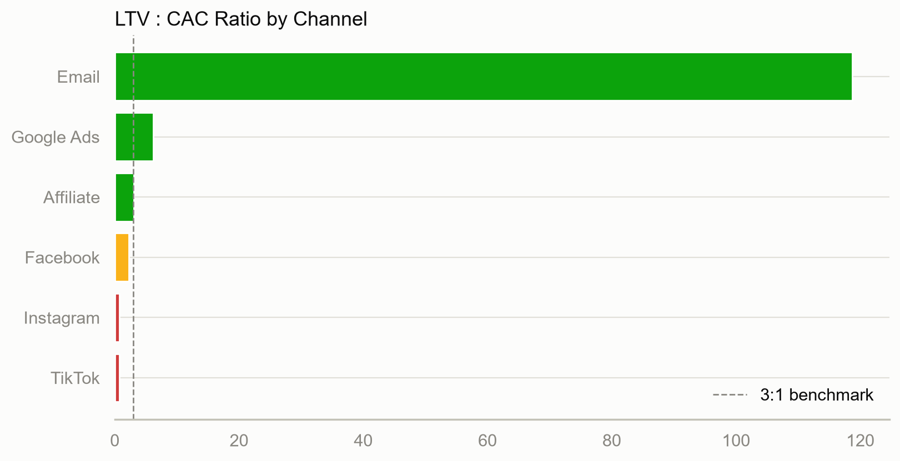
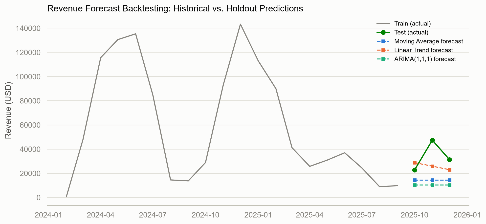

# Marketing + Finance Analytics — A Business Analyst Case Study

**An end-to-end analytics engagement, built to consulting-case-study standard:** data
validation, SQL analysis, marketing performance, customer segmentation, financial
profitability, statistical testing, forecasting, and a quantified executive report —
answering, at every step, *"so what should the business do next?"*

100% Python (pandas, NumPy, Matplotlib, Seaborn, Plotly, statsmodels, SciPy) + SQL
(SQLite) + Jupyter, on a fully synthetic, seeded, reproducible dataset. No external
data downloads, no API keys — clone and run.

---

## Table of Contents

- [Project Overview](#project-overview)
- [Business Problem](#business-problem)
- [Architecture](#architecture)
- [Analytics Workflow](#analytics-workflow)
- [Dataset Description](#dataset-description)
- [Business Questions Answered](#business-questions-answered)
- [Data Model](#data-model)
- [SQL Analysis](#sql-analysis)
- [Python Analysis](#python-analysis)
- [Executive Dashboard](#executive-dashboard)
- [Visualizations](#visualizations)
- [Key Findings](#key-findings)
- [Strategic Recommendations](#strategic-recommendations)
- [Estimated Financial Impact](#estimated-financial-impact)
- [Skills Demonstrated](#skills-demonstrated)
- [Folder Structure](#folder-structure)
- [Setup Instructions](#setup-instructions)
- [Future Improvements](#future-improvements)

---

## Project Overview

This repository simulates a full Business/Marketing Analyst engagement for a
mid-size, subscription-plus-purchases DTC company operating across five countries
and seven marketing channels. It does not stop at descriptive metrics — every
chapter follows a consulting narrative (**Business Question → Methodology →
Analysis → Visualization → Key Insight → Business Recommendation**) and every
recommendation is quantified in dollars, not left as a vague directive.

Deliverables:
- **6 Jupyter notebooks** — a complete, six-chapter analysis
- **21 SQL queries** against a real SQLite database — CTEs, window functions, joins
- **A 14-page PDF Executive Report** — `reports/Executive_Report.pdf`
- **Enterprise-style documentation** — a data dictionary and a documented set of
  data-generation assumptions
- **A seeded, reproducible synthetic dataset** — anyone who clones this repo and
  runs `src/generate_data.py` gets byte-identical data and results

## Business Problem

The company spends across seven channels but could not confidently answer:

1. Which channels and campaigns are **profitable**, not just high-revenue?
2. Which customers and acquisition channels produce the most loyal,
   highest-lifetime-value customers?
3. Is marketing budget allocated efficiently — and if not, by how much could
   reallocating it improve profit?
4. What should revenue look like next quarter, and how much should leadership
   trust that number?

This project delivers a data-driven diagnostic and a prioritized, quantified set
of recommendations — the deliverable a consulting analytics team would produce.

## Architecture



## Analytics Workflow

| Chapter | Notebook | Focus |
|---|---|---|
| 1 | `01_Data_Overview.ipynb` | Business problem, dataset profiling, **10-point data quality audit** |
| 2 | `02_Marketing_Performance.ipynb` | Funnel, campaign, channel, device, country, seasonality |
| 3 | `03_Customer_Analytics.ipynb` | RFM segmentation, cohort retention heatmap, customer lifetime value |
| 4 | `04_Financial_Analysis.ipynb` | CAC, LTV, ROAS, ROI, true profitability, budget reallocation model |
| 5 | `05_Advanced_Analytics.ipynb` | A/B testing (t-test, z-test, CI), revenue forecasting (MA / Linear / ARIMA) |
| 6 | `06_Executive_Report.ipynb` | Interactive Plotly KPI dashboard, executive summary, strategic recommendations |

## Dataset Description

Four related, fully synthetic tables (~3,500 campaign-day rows, 6,000 customers,
~40,700 transactions, seeded with `numpy.random.default_rng(42)`):

| Table | Grain | Key fields |
|---|---|---|
| `campaigns.csv` | 1 row / campaign / day | channel, objective, device, country, audience, spend, impressions, clicks, conversions, revenue |
| `customers.csv` | 1 row / customer | acquisition_channel, acquisition_date, demographics, subscription_plan |
| `transactions.csv` | 1 row / purchase | product_category, amount, discount, profit, refund_flag |
| `ab_test_campaigns.csv` | 1 row / variant / day | 30-day, two-variant creative experiment with a built-in +18% CVR effect |

Every generation assumption (margins, churn, seasonality, channel behavior,
refund/discount logic) is documented in **[`docs/Business_Assumptions.md`](docs/Business_Assumptions.md)**.
Full column-level documentation is in **[`docs/Data_Dictionary.md`](docs/Data_Dictionary.md)**.

A small number of intentional data-quality issues (negative spend, duplicate
rows, orphan transactions, impossible CTR/CVR, etc.) are seeded into the data
specifically so the Chapter 1 data-quality audit has real anomalies to catch.

## Business Questions Answered

1. Which channels, devices, countries, and campaigns are most efficient?
2. Who are our most valuable customers, and how well do we retain them by
   cohort and acquisition channel?
3. What is our *true* profitability by channel — and how should budget be
   reallocated to improve it?
4. Is our new ad creative a statistically significant improvement? What
   should we expect revenue to do next quarter?
5. What are the prioritized, quantified recommendations for leadership?

## Data Model



## SQL Analysis

`sql/business_queries.sql` holds **21 queries** that run directly against
`data/marketing_finance.db` (built by `src/load_to_sqlite.py`), covering:

- Monthly revenue/profit, campaign & channel rankings, CAC/LTV by channel
- **CTEs**, chained CTEs, and an anti-join data-quality check
- **Window functions**: `ROW_NUMBER()`, `RANK()`, `DENSE_RANK()`, `NTILE()`,
  running totals, 7-day moving averages, `LAG()`-based month-over-month growth
- `CASE` tiering, `HAVING` filters, date functions, joins and aggregations

Sample (Q10 — ranking campaigns within channel by revenue):

```sql
SELECT
    channel, campaign_name, total_revenue,
    ROW_NUMBER() OVER (PARTITION BY channel ORDER BY total_revenue DESC) AS row_num,
    RANK()       OVER (PARTITION BY channel ORDER BY total_revenue DESC) AS rank_num,
    DENSE_RANK() OVER (PARTITION BY channel ORDER BY total_revenue DESC) AS dense_rank_num
FROM (SELECT channel, campaign_name, SUM(revenue) AS total_revenue
      FROM campaigns GROUP BY channel, campaign_name) t
ORDER BY channel, row_num;
```

## Python Analysis

- **pandas/NumPy** for data wrangling, RFM scoring, cohort construction
- **Matplotlib/Seaborn** for static analytical charts (consistent, validated
  color system — see `src/utils.py`)
- **Plotly** for the interactive executive dashboard and funnel chart
- **SciPy / statsmodels** for the A/B test (two-proportion z-test, Welch's
  t-test, confidence intervals) and revenue forecasting (Moving Average,
  Linear Trend, ARIMA, backtested with RMSE/MAE)
- **ReportLab** to programmatically assemble the 14-page PDF executive report

## Executive Dashboard



*Interactive version (hoverable, zoomable) in `notebooks/06_Executive_Report.ipynb`.*

## Visualizations

<table>
<tr>
<td width="50%">

**Channel Efficiency: ROAS vs. CPA**


</td>
<td width="50%">

**Monthly Cohort Retention Heatmap**


</td>
</tr>
<tr>
<td width="50%">

**Revenue vs. Net Profit by Channel**


</td>
<td width="50%">

**A/B Test: Conversion Rate by Variant**


</td>
</tr>
<tr>
<td width="50%">

**LTV : CAC Ratio by Channel**


</td>
<td width="50%">

**Revenue Forecast Backtest**


</td>
</tr>
</table>

## Key Findings

- **Revenue rank ≠ profit rank.** At least one top-line-revenue channel drops
  in the true net-profit ranking once marketing spend and category margins
  are applied — the central finding of the engagement (`04_Financial_Analysis.ipynb`).
- **LTV:CAC, not first-touch ROAS, separates efficient channels.** Some
  paid-social channels sit at or below the 1:1 break-even line despite
  reasonable ROAS.
- **Month 0-to-1 retention is the steepest cliff** in the customer lifecycle —
  the single highest-leverage retention intervention point.
- **Creative Variant B is a statistically validated win** (p < 0.05 on two
  independent tests, +18% relative conversion lift).
- **A 15%-of-spend budget reallocation is modeled profit-positive** — see the
  Executive Report for the exact dollar figures.

## Strategic Recommendations

Full detail with quantified impact is in `notebooks/06_Executive_Report.ipynb`
and `reports/Executive_Report.pdf`. Summary:

| # | Recommendation | Expected Impact |
|---|---|---|
| 1 | Shift 15% of spend from the weakest to the strongest elastic paid channels | Quantified net profit & revenue increase (see PDF report) |
| 2 | Roll out ad creative Variant B to 100% of spend | Quantified incremental conversions & revenue |
| 3 | Launch a 30-day onboarding / second-purchase campaign | Compounding LTV:CAC improvement |
| 4 | Increase investment in the Email program (capacity-, not efficiency-, constrained) | Incremental profit near best-in-portfolio ROAS |
| 5 | Pilot a 20% spend increase in India | Tests scalability of an under-leveraged, cost-efficient market |

## Estimated Financial Impact

The full quantified model — including the exact dollar values behind each
recommendation above — is computed live from the dataset in
`04_Financial_Analysis.ipynb` and `06_Executive_Report.ipynb`, and
summarized in **[`reports/Executive_Report.pdf`](reports/Executive_Report.pdf)**.
Because all figures are recomputed from source data at generation time, the
report, the dashboard, and the notebooks are always numerically consistent.

## Skills Demonstrated

`Python` · `pandas` / `NumPy` · `SQL` (CTEs, window functions, joins) ·
`Matplotlib` / `Seaborn` / `Plotly` · `SciPy` / `statsmodels` (hypothesis
testing, ARIMA forecasting) · RFM segmentation · Cohort & retention analysis ·
CAC / LTV / ROAS / ROI modeling · Budget optimization · A/B testing ·
Data quality auditing · Technical documentation · Executive communication
(PDF report generation, dashboard design)

## Folder Structure

```
marketing-finance-analytics/
├── README.md
├── requirements.txt
├── data/
│   ├── raw/                        # campaigns.csv, customers.csv, transactions.csv, ab_test_campaigns.csv
│   └── marketing_finance.db        # SQLite database (built by src/load_to_sqlite.py)
├── docs/
│   ├── Business_Assumptions.md     # every data-generation assumption, documented
│   └── Data_Dictionary.md          # every table/column, enterprise-doc style
├── sql/
│   └── business_queries.sql        # 21 runnable business queries
├── reports/
│   ├── Executive_Report.pdf        # 14-page consulting-style report
│   └── figures/                    # chart PNGs (used in the PDF and this README)
├── src/
│   ├── generate_data.py            # seeded synthetic data generator
│   ├── load_to_sqlite.py           # loads CSVs into the SQLite database
│   ├── utils.py                    # KPI formulas + shared chart styling
│   └── generate_report.py          # assembles the PDF executive report
└── notebooks/
    ├── 01_Data_Overview.ipynb
    ├── 02_Marketing_Performance.ipynb
    ├── 03_Customer_Analytics.ipynb
    ├── 04_Financial_Analysis.ipynb
    ├── 05_Advanced_Analytics.ipynb
    └── 06_Executive_Report.ipynb
```

## Setup Instructions

```bash
# 1. Clone and enter the project
cd marketing-finance-analytics

# 2. Create a virtual environment and install dependencies
python -m venv .venv
.venv\Scripts\activate            # Windows
# source .venv/bin/activate       # macOS/Linux
pip install -r requirements.txt

# 3. Generate the synthetic dataset (seeded — fully reproducible)
python src/generate_data.py

# 4. Load it into SQLite for the SQL analysis
python src/load_to_sqlite.py

# 5. Run the notebooks in order (01 -> 06), or open Jupyter and run all
jupyter notebook notebooks/

# 6. (Optional) Regenerate the PDF executive report after running the notebooks
python src/generate_report.py
```

All notebooks are self-contained (each loads its own data) and execute
top-to-bottom without manual intervention.

## Future Improvements

See [`docs/PROJECT_PLAN.md`](docs/PROJECT_PLAN.md) for the build sequencing, scope
decisions, and the reasoning behind this list.

- Deploy the executive dashboard as a live Streamlit/Dash app instead of a
  static notebook export
- Extend the forecasting model to SARIMA/Prophet once more than two years of
  history is available, to properly separate trend from annual seasonality
- Add a marketing-mix (media mix modeling) layer to estimate diminishing
  returns at the margin, rather than assuming constant marginal ROI in the
  budget-reallocation model
- Automate the data-quality checks as a scheduled test suite (e.g. dbt tests
  or Great Expectations) against the SQLite/warehouse layer
